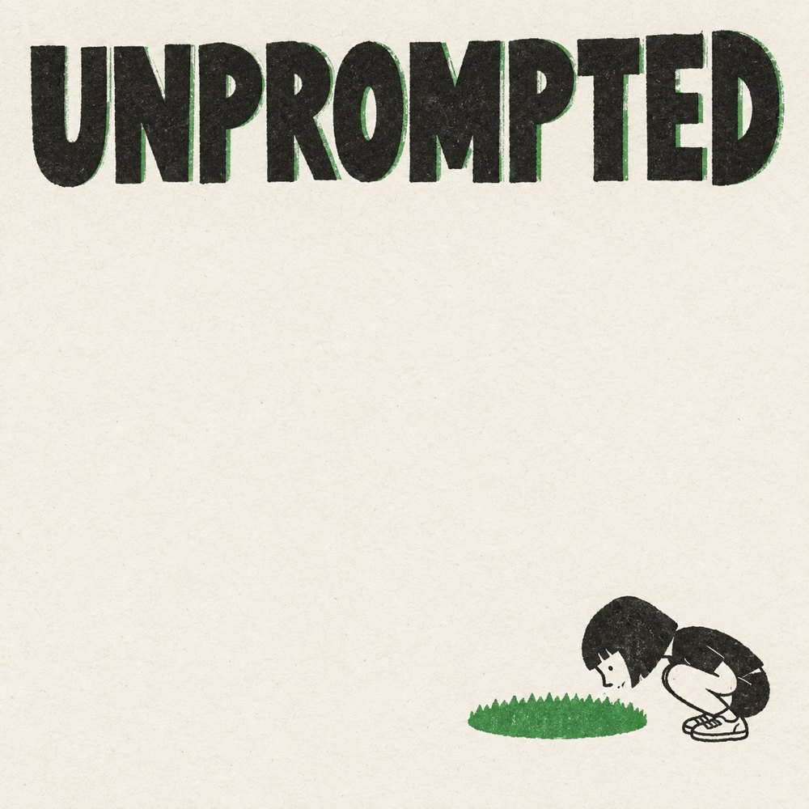

# UNPROMPTED

Eight-page illustrated stories from a short seed. An editor writes the script. An illustrator draws the pages, words included.

**[Read the gallery](https://zine.serg.lol) · [Read Clover](https://zine.serg.lol/clover/) · [Make an issue](PLAYBOOK.md)**

<table>
<tr>
<td></td>
<td></td>
<td></td>
</tr>
</table>

The default brief: square pages, black plus one accent ink, flat shapes, a recurring character, and sixty words maximum. The artwork imitates risograph print. Some issues experiment with other palettes and styles.

This repository contains the artwork, source scripts, prompts, gallery builder, and optional production tools. You can read the books without an AI account. The gallery serves individual pages. It does not create a folded print sheet or PDF.

## Start with Clover

The seed is **“a girl looking in the grass for four-leaf clovers.”** The editor chose green ink. Repetition carries the joke: three leaves, three leaves, resignation, then a raccoon gets the lucky find.

| File | What to look for |
| --- | --- |
| [DIRECTION.md](models/clover/DIRECTION.md) | The format, word budget, seed, and optional place detail |
| [SCRIPT.md](models/clover/SCRIPT.md) | Exact printed words and a separate picture description for each page |
| [STYLE.md](art/STYLE.md) | Shared ink, paper, shapes, type, and texture instructions |
| [1.jpg](models/clover/1.jpg) through [8.jpg](models/clover/8.jpg) | The finished eight-page sequence |
| [COST.json](models/clover/COST.json) | A historical estimate with incomplete editor usage |

Read the script beside the images. Each `Words:` block defines the text. Each `Picture:` block gives the illustrator a composition. Silent pages still have a picture description. The final image contains both the art and its lettering.

## Preview the gallery locally

Requirements: Git, Python 3, and Pillow. Run these commands from a terminal:

```sh
git clone https://github.com/fbserg/zine.git
cd zine
python3 -m venv .venv
. .venv/bin/activate
python3 -m pip install Pillow
python3 scripts/site.py
python3 -m http.server 8000 --bind 127.0.0.1 --directory site
```

Open <http://localhost:8000> or <http://localhost:8000/clover/>. Stop the server with Ctrl+C.

The builder replaces `site/` on every run. It includes each `models/<name>/` folder with an `8.jpg`, then reads all eight numbered images. Missing earlier pages cause a build error. It creates thumbnails beside the source images and copies them into `site/`. Generated files are ignored by Git.

This static preview shows the books. Votes, comments, and prompt suggestions need the Worker API. Their requests fail under Python's static server. Use the Worker preview below to test those features.

## Make your first issue

Follow the [full production guide](PLAYBOOK.md) for a Clover-based walkthrough, prompt assembly, image checks, and optional automation.

The portable path is manual:

1. Create `models/my-clover/` with a fresh name. Use lowercase letters, numbers, and hyphens.
2. Write `DIRECTION.md` from [the shared rules](direction/RULES.md), then add one short seed.
3. Give an editor the direction and [shared style](art/STYLE.md). Use [the editor prompt](scripts/codex-write-plan.md).
4. Save its eight-page script as `SCRIPT.md`.
5. Give one illustrator the script, direction, style, and [illustrator prompt](scripts/codex-draw-plan.md).
6. Review every page and save square RGB JPEGs as `1.jpg` through `8.jpg`.
7. Rebuild the gallery and read the entire sequence locally.

A per-issue `STYLE.md` can replace the shared style. `COST.json` is optional. The gallery can display images without a script, but include one so readers can inspect the process.

## Repository map

| Path | Purpose |
| --- | --- |
| `models/<name>/` | Issue artwork, script, direction, optional style, and cost estimate |
| `direction/RULES.md` | Default format and creative constraints |
| `direction/SEEDS.md` | Seed and style experiments |
| `art/STYLE.md` | Shared illustration brief |
| `art/`, `ab/`, root `SCRIPT.md` | Original artwork and early comparisons |
| `PLAYBOOK.md` | Manual workflow, automation prerequisites, and recovery notes |
| `scripts/site.py` | Static gallery and thumbnail builder |
| `scripts/codex-*-plan.md` | Editor and illustrator prompts |
| `scripts/book.sh`, `finish.sh` | Optional local production and recovery scripts |
| `scripts/queue.sh`, `drain.sh` | Optional local batch queue |
| `scripts/cost.py` | Historical usage estimator from local agent logs |
| `scripts/deploy.sh` | Gallery build and Cloudflare deployment |
| `src/worker.js` | Vote, comment, and suggestion API |
| `wrangler.toml` | Generic Worker configuration for local preview |

## How the pieces fit

```text
seed + direction + style
            |
            v
      editor -> SCRIPT.md
                    |
                    v
              illustrator -> 1.jpg ... 8.jpg
                                   |
                                   v
                         site.py -> site/
                                      |
                         +------------+------------+
                         |                         |
                    static server          Cloudflare Worker
                    artwork only           artwork + KV API
```

The builder does not call an AI model. It copies finished artwork, creates thumbnails, and writes HTML. Git timestamps determine the initial newest-first order. A source ZIP or a fresh history loses the original issue dates, so that order can differ from the live archive.

The Worker does not generate books. It serves the built files and handles reader interactions. New prompts submitted through the gallery become suggestions in KV. They do not start `book.sh` or enter its local queue.

The archive records prompts as Markdown. The gallery extracts seed text by removing known rule lines from each direction file. Old issues can show extra rule text when their original rule history is absent.

## Preview the Worker

Install Node.js and npm, then build the gallery as above:

```sh
npx --yes wrangler@4 dev
```

Open the local URL Wrangler prints. The `VOTES` binding uses local KV storage for this preview. It contains no live gallery votes or comments. Local state lives in the ignored `.wrangler/` directory.

The Worker serves static assets through `ASSETS`. It stores vote totals, browser vote choices, comments, and prompt suggestions through `VOTES`. A `vid` cookie identifies a browser for votes and comment limits. Favorites stay in browser local storage.

These are small-gallery controls. The Worker has no account system or moderation dashboard. Vote updates use KV read/modify/write operations, so concurrent votes can lose updates. Cookie-based limits do not prevent a visitor from resetting their identity.

| API route | Behavior |
| --- | --- |
| `GET /api/votes` | Return book totals and this browser's choices |
| `POST /api/vote` | Set, switch, or clear a book vote with `name` and `dir` |
| `GET /api/comments?name=clover` | Return the issue's retained comments |
| `POST /api/comment` | Add `text` to an issue, or to `_ideas` for a prompt suggestion |
| `POST /api/idea-vote` | Toggle a suggestion vote by its `at` timestamp |

Comments have a 140-character limit. Each issue retains its latest 50 comments. A browser must wait 30 seconds between comments on the same issue. Comment text is public. Browser identifiers remain in KV and are omitted from comment responses.

## Deploy your own gallery

Use your own Cloudflare account and resources. Production identifiers and credentials are not part of the public configuration.

```sh
cp wrangler.toml wrangler.local.toml
npx --yes wrangler@4 login
npx --yes wrangler@4 kv namespace create VOTES
```

Edit the ignored `wrangler.local.toml`:

- Set `name` to your Worker name.
- Add `id = "YOUR_NAMESPACE_ID"` under `[[kv_namespaces]]`, using the ID from the command.
- Keep the `VOTES` and `ASSETS` binding names unchanged.
- If you own a custom domain, add its route. Otherwise, use the Worker URL.

The gallery's Open Graph image URL still points to the original gallery. For your own site, change that URL in `scripts/site.py`. The optional production scripts also print the original gallery URL in their final output.

Then deploy:

```sh
scripts/deploy.sh
```

The script requires `wrangler.local.toml`, rebuilds `site/`, and deploys the Worker with that configuration. It does not push Git commits. Keep the Python virtual environment active so Pillow remains available.

For unattended deployment, supply Cloudflare's standard authentication variables through your shell or secret manager. Do not put credentials in repository files.

## Costs and reproducibility

`COST.json` records estimated token and image costs from past runs. These numbers are not invoices or current price quotes. An asterisk in the gallery marks an incomplete estimate. Clover's editor usage is absent, so its estimate covers the recorded illustration run only.

`scripts/cost.py` reads local Claude and Codex logs. Its parsers and price table describe the original experiments. Missing logs produce incomplete estimates. Do not run it over the archive unless you intend to replace its stored estimates.

The prompts make the process inspectable. They do not reproduce identical images. Model access, model names, and image output vary by environment. The manual workflow works without the original local agent configuration.

## What stays local

Raw image generations, execution logs, agent state, queue files, generated HTML, local KV state, and deployment configuration are ignored by Git. Live gallery data stays in Cloudflare KV. Review artwork and prompts for personal details before you add a new issue.

## Checks and troubleshooting

With the Python environment active, run:

```sh
python3 -m unittest discover -s tests -v
```

The suite builds the gallery, checks every published image, checks asset header patterns, and tests deployment and cost lookup with isolated fixtures. It also checks issue-name validation and failed-commit behavior. It does not spend model credits or deploy. Gallery tests replace `site/` and can refresh ignored thumbnails.

| Symptom | Check |
| --- | --- |
| `No module named PIL` | Activate `.venv` and install Pillow there |
| A new issue does not appear | Confirm `models/<name>/8.jpg` exists, then rebuild |
| A build fails on a missing image | Supply all eight numbered JPEGs |
| Votes or comments fail in the Python preview | Use `wrangler dev` for the API |
| Deployment asks for local configuration | Copy `wrangler.toml` to `wrangler.local.toml` and set your Worker name and KV ID |
| The automated editor cannot start | Configure its local agent or use the manual workflow |
| The illustrator reports `NO_IMAGE_TOOL` | Use an environment with image generation access |
| A cost estimate is absent or partial | Check local logs. Existing image files do not reconstruct token usage. |
| A replacement image looks stale after deployment | JPEG responses permit long-lived caches. Use a fresh issue name for a revised edition. |
